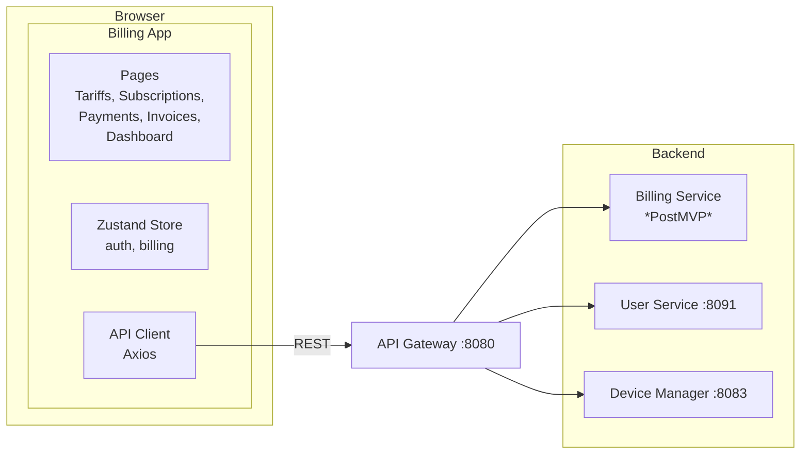

# 💳 Web Billing — Архитектура (план)

> Тег: `ЧЕРНОВИК` | Обновлён: `2026-06-02` | Версия: `0.1`
> **Статус:** PostMVP — документ описывает **планируемую** архитектуру.

## Обзор

Web Billing — отдельное веб-приложение для управления биллингом.
Аналогичный стек с web-frontend (React + TypeScript + Vite).
Общается с backend через API Gateway.

## Планируемая схема



## Планируемые экраны

| Экран | Описание | Компоненты |
|-------|----------|-----------|
| **Login** | Аутентификация (shared с web-frontend) | LoginForm |
| **Dashboard** | Общая финансовая сводка | BalanceCard, RevenueChart, AlertsPanel |
| **Tariffs** | CRUD тарифных планов | TariffList, TariffForm, TariffDetails |
| **Subscriptions** | Подписки организаций | SubscriptionList, SubscriptionForm |
| **Invoices** | Счета, генерация PDF | InvoiceList, InvoiceDetails, PDFExport |
| **Payments** | История платежей | PaymentList, PaymentDetails |
| **Reports** | Финансовая отчётность | ReportFilters, RevenueChart, ExportButton |

## Планируемая структура проекта

```
src/
├── app/
│   ├── App.tsx
│   ├── Router.tsx
│   └── providers/
├── pages/
│   ├── Dashboard/
│   ├── Tariffs/
│   ├── Subscriptions/
│   ├── Invoices/
│   ├── Payments/
│   ├── Reports/
│   └── Login/
├── features/
│   ├── tariffs/
│   │   ├── components/
│   │   ├── hooks/
│   │   └── api/
│   ├── subscriptions/
│   ├── invoices/
│   ├── payments/
│   └── reports/
├── shared/
│   ├── components/
│   ├── hooks/
│   └── utils/
├── store/
│   ├── authStore.ts
│   └── billingStore.ts
├── services/
│   └── apiClient.ts
├── types/
│   ├── tariff.ts
│   ├── subscription.ts
│   ├── invoice.ts
│   └── payment.ts
└── styles/
```

## Планируемые TypeScript типы

```typescript
// types/tariff.ts
interface Tariff {
  id: string;
  name: string;
  description: string;
  billingModel: 'per_device' | 'per_point' | 'flat';
  pricePerUnit: number;       // Цена за единицу (устройство/точку/месяц)
  currency: 'RUB' | 'USD';
  minDevices: number;
  maxDevices: number;
  features: string[];
  isActive: boolean;
}

// types/subscription.ts
interface Subscription {
  id: string;
  organizationId: string;
  tariffId: string;
  status: 'active' | 'suspended' | 'expired' | 'cancelled';
  startDate: Date;
  endDate: Date;
  autoRenew: boolean;
  deviceCount: number;
  monthlyAmount: number;
}

// types/invoice.ts
interface Invoice {
  id: string;
  organizationId: string;
  subscriptionId: string;
  amount: number;
  currency: string;
  status: 'draft' | 'sent' | 'paid' | 'overdue' | 'cancelled';
  issuedAt: Date;
  dueDate: Date;
  paidAt?: Date;
  items: InvoiceItem[];
}

// types/payment.ts
interface Payment {
  id: string;
  invoiceId: string;
  amount: number;
  method: 'card' | 'bank_transfer' | 'yookassa';
  status: 'pending' | 'completed' | 'failed' | 'refunded';
  transactionId?: string;
  processedAt?: Date;
}
```

## Планируемый Backend (Billing Service)

> Billing Service пока **не существует** как отдельный Scala-сервис.
> При реализации — создать `services/billing-service/` (Scala 3 + ZIO 2)
> или реализовать как часть User/Admin Service.

### Планируемые API endpoints

| Метод | Путь | Описание |
|-------|------|----------|
| GET | `/api/v1/tariffs` | Список тарифов |
| POST | `/api/v1/tariffs` | Создать тариф |
| GET | `/api/v1/subscriptions` | Подписки организации |
| POST | `/api/v1/subscriptions` | Оформить подписку |
| GET | `/api/v1/invoices` | Счета организации |
| POST | `/api/v1/invoices/{id}/pay` | Оплатить счёт |
| GET | `/api/v1/payments` | История платежей |
| GET | `/api/v1/billing/dashboard` | Финансовая сводка |

## Legacy биллинг (справка)

В старой системе (legacy-stels) биллинг включал:
- Таблицы: `tariffs`, `balanceHistoryWithDetails`, `yandexPayment`, `billingRoles`, `billingPermissions`
- ExtJS UI (billingwebapp)
- ЮKassa (Яндекс.Касса) интеграция

Подробный анализ: `docs/stels/LEGACY_DATABASE_SCHEMA.md` §I.
